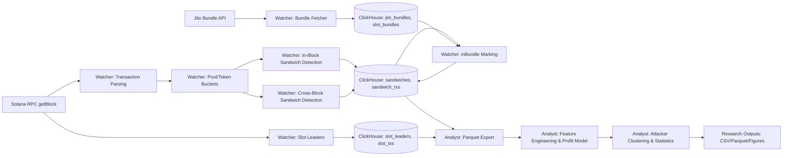

# solana-mev

This repository implements an end-to-end system for detecting and analyzing sandwich attacks on Solana. The pipeline consists of a real-time detection engine, a quantitative analysis stack, and a ClickHouse-backed persistence layer.

## System Architecture

The pipeline integrates on-chain data acquisition, heuristic detection, bundle-aware enrichment, and offline analysis:

## Threat Model

We assume an adversary capable of submitting high-priority transactions and constructing private bundles via the Jito block engine. The adversary can observe the transaction stream within the short Solana slot window and reorder their own transactions within a block or across adjacent slots, but cannot rewrite finalized blocks or tamper with validator signatures. Victims are modeled as latency-sensitive swaps routed through AMM pools; they do not coordinate with the adversary and lack access to private order flow.

Solana’s high throughput and approximately 0.4s slot time compress the attack window and reduce observability, which makes near-real-time detection essential. Our system explicitly models this constraint by parallelizing slot ingestion, separating in-block and cross-block detection, and integrating bundle-aware post-processing.

## Core Contributions

- [Our Contribution] A pool- and token-consistent heuristic detector that matches multi-front/multi-back sandwiches using amount-similarity constraints and victim placement rules, while tolerating SOL-specific fee noise.
- [Our Contribution] A low-latency detection pipeline that parallelizes slot ingestion, uses a bounded cross-block cache, and enforces leader-contiguity windows to mitigate missed detections under rapid state transitions.
- [Our Contribution] A bundle-aware enrichment path that marks sandwich transactions participating in Jito bundles, enabling separate evaluation of public versus private order flow.

## Documentation

- [docs/watcher.md](docs/watcher.md)
- [docs/analyst.md](docs/analyst.md)
- [docs/database.md](docs/database.md)
- [docs/roadmap.md](docs/roadmap.md)